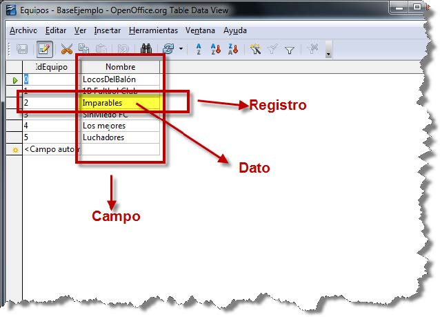

# Unidad 1: Sistemas de Almacenamiento de la Información
Esta unidad tiene como objetivo introducir los conceptos básicos relacionados con los mecanismos de almacenamiento, su clasificación, ventajas e inconvenientes, y sentar las bases para comprender el funcionamiento de los sistemas gestores de bases de datos (SGBD).

- [Unidad 1: Sistemas de Almacenamiento de la Información](#unidad-1-sistemas-de-almacenamiento-de-la-información)
  - [0. Introducción](#0-introducción)
  - [1. Ficheros](#1-ficheros)
    - [1.1 Tipos de ficheros y formatos](#11-tipos-de-ficheros-y-formatos)
    - [1.2 Problemas de los sistemas basados en ficheros](#12-problemas-de-los-sistemas-basados-en-ficheros)
  - [2. Bases de Datos](#2-bases-de-datos)
    - [2.1 Conceptos](#21-conceptos)
    - [2.2 Usos y tipos según el modelo de datos](#22-usos-y-tipos-según-el-modelo-de-datos)
    - [2.3 Ubicación de la información](#23-ubicación-de-la-información)
  - [3. Sistemas Gestores de Bases de Datos (SGBD)](#3-sistemas-gestores-de-bases-de-datos-sgbd)
    - [3.1 Funciones de un SGBD](#31-funciones-de-un-sgbd)
    - [3.2 Componentes de un SGBD](#32-componentes-de-un-sgbd)
    - [3.3 Tipos de SGBD](#33-tipos-de-sgbd)
  - [4. Bases de Datos Centralizadas y Distribuidas](#4-bases-de-datos-centralizadas-y-distribuidas)
    - [4.1 Bases de datos centralizadas](#41-bases-de-datos-centralizadas)
    - [4.2 Bases de datos distribuidas](#42-bases-de-datos-distribuidas)
    - [4.3 Modelos relacionados](#43-modelos-relacionados)
  - [5. Modelo de Capas](#5-modelo-de-capas)
    - [5.1 Arquitectura ANSI-SPARC: los tres niveles](#51-arquitectura-ansi-sparc-los-tres-niveles)
    - [5.2 Independencia de los datos](#52-independencia-de-los-datos)
    - [5.3 Modelo funcional de cinco capas](#53-modelo-funcional-de-cinco-capas)
  - [6. Lenguaje SQL](#6-lenguaje-sql)
  - [7. Transacciones y ACID](#7-transacciones-y-acid)
  - [8. Diseño de Bases de Datos](#8-diseño-de-bases-de-datos)
  - [9. Tipos de Usuarios](#9-tipos-de-usuarios)
  - [10. Actividades de aprendizaje](#10-actividades-de-aprendizaje)

## 0. Introducción
En el contexto de los sistemas informáticos, el almacenamiento de la información es un aspecto fundamental que ha evolucionado desde simples estructuras de ficheros hasta complejos sistemas de bases de datos. 

A lo largo de la historia de la informática, el tratamiento de la información ha pasado de ser un proceso centrado en los programas (orientado al proceso) a estar centrado en los datos (orientado a la información). Esta evolución ha permitido mejorar la eficiencia, la seguridad, la integridad y la accesibilidad de los datos, especialmente en entornos multiusuario y distribuidos.


## 1. Ficheros
Los ficheros son estructuras de información que permiten almacenar datos en dispositivos físicos como discos duros, memorias USB, SSD, etc. Son gestionados por el sistema operativo y constituyen la forma más básica de almacenamiento digital. Cada fichero tiene un nombre y una extensión que indica el tipo de contenido que almacena (por ejemplo, .txt, .jpg, .mp3).

### 1.1 Tipos de ficheros y formatos
Los ficheros pueden clasificarse según:

a) Su contenido interno

- **Ficheros de texto**: contienen caracteres codificados en sistemas como ASCII o Unicode. Son legibles por humanos y por editores de texto. Ejemplos:
  - .txt: texto plano.
  - .csv: valores separados por comas.
  - .html: páginas web.
  - .xml: datos estructurados.

- **Ficheros binarios**: contienen datos codificados que no son legibles directamente. Requieren programas específicos para su interpretación. Ejemplos:
    - .exe: ejecutables.
    - .jpg, .png: imágenes.
    - .mp3, .wav: audio.
    - .docx, .xlsx: documentos de ofimática.

> **Ejemplo práctico**: si abrimos un fichero .docx con el bloc de notas, veremos una secuencia de caracteres sin sentido, ya que el editor no interpreta el formato binario. En cambio, un .txt mostrará el contenido directamente.

b) Su organización o forma de acceso
- **Ficheros secuenciales**: los datos se almacenan uno tras otro. Para acceder a un dato específico, es necesario recorrer todos los anteriores. Son eficientes para escritura continua, pero lentos para búsquedas. Ejemplo: una lista de clientes en un fichero .txt.
- **Ficheros de acceso directo** (organización directa): permiten acceder a un dato concreto sin necesidad de recorrer todo el fichero. Esto se logra mediante posiciones fijas o cálculos de desplazamiento. Ejemplo: un fichero donde cada registro ocupa exactamente 100 bytes.
- **Ficheros indexados**: utilizan estructuras auxiliares (índices) que permiten localizar rápidamente los datos. El índice actúa como una guía que relaciona claves con posiciones en el fichero. Ejemplo: un fichero de libros con un índice por ISBN.

### 1.2 Problemas de los sistemas basados en ficheros
Aunque los ficheros son útiles para almacenar información, presentan varias limitaciones cuando se utilizan como base para sistemas de gestión:
- **Redundancia**: la misma información puede estar duplicada en varios ficheros.
- **Inconsistencia**: si se actualiza un dato en un fichero pero no en otro, se genera incoherencia.
- **Dependencia física**: los programas dependen de la estructura interna del fichero, lo que dificulta su mantenimiento.
- **Falta de seguridad**: no hay control sobre quién accede a qué datos.
- **Acceso limitado**: no se pueden realizar consultas complejas sin desarrollar programas específicos.
- **Dificultad para compartir datos**: cada aplicación puede tener su propio formato, lo que complica la interoperabilidad.

> **Ejemplo**: en una empresa, el departamento de ventas y el de contabilidad pueden tener ficheros distintos con los datos de los clientes. Si un cliente cambia de dirección, ambos ficheros deben actualizarse manualmente. Si se olvida hacerlo en uno de ellos, se genera una inconsistencia.

> Actividades de aprendizaje 


## 2. Bases de Datos
Las bases de datos son una evolución natural de los sistemas de almacenamiento de información. Frente a las limitaciones de los ficheros tradicionales, las bases de datos permiten organizar, acceder y gestionar grandes volúmenes de información de forma eficiente, segura y estructurada.

Una base de datos no es solo un conjunto de datos, sino una estructura diseñada para facilitar su uso por múltiples usuarios y aplicaciones, manteniendo la integridad, la coherencia y la disponibilidad de la información.

### 2.1 Conceptos
A continuación se definen los principales elementos que componen una base de datos:
- **Dato**: unidad mínima de información. Ejemplo: 2025, Madrid, Juan.
- **Tipo de dato**: define la naturaleza del dato. Ejemplos: texto, número entero, fecha, booleano.
- **Campo**: conjunto de datos del mismo tipo que representan una característica. Ejemplo: Nombre, Fecha de nacimiento.
- **Registro**: conjunto de campos que describen una entidad. Ejemplo: los datos de un alumno.
- **Tabla**: colección de registros organizados en filas y columnas. Ejemplo: tabla Alumnos con campos DNI, Nombre, Curso.



Otros conceptos: 
- **Consulta**: instrucción que permite recuperar información de la base de datos según ciertos criterios.
- **Índice**: estructura que acelera la búsqueda de registros en una tabla.
- **Vista**: tabla virtual generada a partir de una o varias tablas, útil para mostrar solo ciertos datos.
- **Informe**: presentación estructurada de los datos, normalmente como salida de una consulta.
- **Script**: conjunto de instrucciones que automatizan tareas sobre la base de datos.
- Esquema o diccionario de datos: define la estructura de la base de datos (tablas, campos, relaciones).

> **Ejemplo**: en una base de datos escolar, podríamos tener una tabla Alumnos con campos como DNI, Nombre, Apellidos, Fecha de nacimiento, y otra tabla Matriculaciones que relaciona alumnos con módulos.

### 2.2 Usos y tipos según el modelo de datos

Las bases de datos se utilizan en prácticamente todos los ámbitos de la sociedad:
- **Administración**: gestión de clientes, facturas, productos, empleados.
- **Educación**: control de alumnos, profesores, asignaturas, evaluaciones.
- **Ciencia**: almacenamiento de datos experimentales, simulaciones, estadísticas.
- **Salud**: historiales médicos, citas, tratamientos.
- **Comercio electrónico**: catálogos de productos, pedidos, usuarios.
- **Motores de búsqueda**: como Google, que utilizan bases de datos distribuidas de gran tamaño.

Tipos de bases de datos según el modelo de datos:
- **Jerárquicas**: organizan los datos en forma de árbol. *Obsoletas*.
- **En red**: permiten relaciones más complejas entre registros. *También en desuso*.
- **Relacionales**: organizan los datos en tablas relacionadas. Son las más utilizadas. Ejemplo: MySQL, PostgreSQL.
- **Orientadas a objetos**: permiten almacenar objetos completos con sus atributos y métodos.
- **Objeto-relacionales**: combinan características de las relacionales y orientadas a objetos.
- **Documentales**: almacenan datos semiestructurados como JSON o XML. Ejemplo: MongoDB.
- **Multidimensionales**: usadas en inteligencia de negocio (OLAP).
- **Deductivas**: permiten realizar inferencias a partir de reglas lógicas.
>**Actividad sugerida**: Investiga y clasifica cinco bases de datos reales (comerciales o libres) según su modelo de datos.

### 2.3 Ubicación de la información
La ubicación física de una base de datos influye en su accesibilidad, rendimiento y seguridad. Existen varios modelos:
- **Local**: la base de datos se encuentra en el mismo equipo que la aplicación. Ejemplo: una base de datos en Access.
- **En servidor**: la base de datos reside en un servidor y se accede desde otros equipos a través de una red local o Internet.
- **Distribuida**: los datos se reparten entre varios servidores geográficamente separados. Ejemplo: bases de datos de grandes empresas con sedes en distintas ciudades.
- **Reflejada**: se mantiene una copia exacta de la base de datos en varios servidores para garantizar disponibilidad y seguridad.

> Ejemplo práctico: una empresa con oficinas en Madrid, Barcelona y Valencia puede tener una base de datos distribuida, donde cada sede gestiona sus propios datos, pero todos están sincronizados.

**Actividad:** Diseña una tabla simulada en papel con campos y registros.

## 3. Sistemas Gestores de Bases de Datos (SGBD)
Un **Sistema Gestor de Bases de Datos (SGBD)** es un conjunto de programas que permite crear, administrar y utilizar bases de datos de forma eficiente. Su aparición supuso una mejora significativa respecto al uso de ficheros, al ofrecer mecanismos para garantizar la integridad, seguridad y accesibilidad de los datos, incluso en entornos multiusuario y distribuidos.

### 3.1 Funciones de un SGBD
Las funciones de un SGBD pueden variar según el tipo y el fabricante, pero en general incluyen:

- Almacenamiento, acceso y actualización de datos: permite a los usuarios realizar operaciones como insertar, modificar, eliminar y consultar datos.
- Garantía de integridad: asegura que los datos cumplen ciertas reglas (por ejemplo, que una fecha no sea anterior a hoy).
- Seguridad: controla qué usuarios pueden acceder a qué datos y qué operaciones pueden realizar.
- Concurrencia: permite que varios usuarios accedan simultáneamente a la base de datos sin interferencias.
- Gestión de transacciones: agrupa operaciones en bloques que se ejecutan como una unidad (con propiedades ACID: atomicidad, consistencia, aislamiento, durabilidad).
- Independencia de los datos: los datos están separados de las aplicaciones que los usan, lo que facilita su mantenimiento.
- Recuperación ante fallos: incluye mecanismos para restaurar la base de datos en caso de errores o caídas del sistema.
- Diccionario de datos: almacena metadatos sobre la estructura de la base de datos.
- Estadísticas y auditoría: registra operaciones realizadas, errores, accesos, etc.

> Ejemplo práctico: en una base de datos de una tienda online, el SGBD garantiza que dos usuarios no puedan comprar el mismo producto si solo queda una unidad disponible, gracias a la gestión de concurrencia y transacciones.

### 3.2 Componentes de un SGBD
Un SGBD está formado por varios componentes que trabajan conjuntamente:
- Procesador de consultas: interpreta las instrucciones SQL y genera un plan de ejecución.
- Motor de ejecución: realiza las operaciones solicitadas sobre los datos.
- Gestor de transacciones: asegura que las operaciones agrupadas se ejecuten correctamente.
- Gestor de concurrencia: controla el acceso simultáneo a los datos.
- Gestor de recuperación: permite restaurar la base de datos tras un fallo.
- Gestor de almacenamiento: organiza los datos en disco y gestiona el espacio.
- Gestor de archivos: interactúa con el sistema operativo para acceder a los ficheros físicos.
- Memoria intermedia (buffer): almacena temporalmente los datos más usados para mejorar el rendimiento.
- Diccionario de datos: contiene información sobre la estructura de la base de datos (tablas, campos, relaciones, restricciones).

> Ejemplo visual: el procesador de consultas traduce una instrucción SELECT en una serie de pasos que el motor ejecuta, accediendo a los datos a través del gestor de almacenamiento y utilizando el buffer para acelerar el proceso.

### 3.3 Tipos de SGBD
Los SGBD se pueden clasificar según distintos criterios:

a) Por modelo de datos
- Relacionales: basados en tablas y relaciones. Ejemplo: MySQL, PostgreSQL, Oracle.
- Objeto-relacionales: combinan tablas con estructuras orientadas a objetos. Ejemplo: Oracle, SQL Server.
- Orientados a objetos: almacenan objetos completos. Ejemplo: db4o, ObjectDB.
- NoSQL: diseñados para datos no estructurados o semiestructurados. Ejemplo: MongoDB, Cassandra.

b) Por uso
- Ofimáticos: pensados para uso personal o en pequeñas organizaciones. Ejemplo: Microsoft Access, LibreOffice Base.
- Corporativos: diseñados para entornos empresariales con grandes volúmenes de datos y múltiples usuarios. Ejemplo: Oracle, IBM DB2, SAP Sybase.

c) Por arquitectura
- Centralizados: toda la base de datos reside en un único servidor.
- Distribuidos: los datos se reparten entre varios servidores.
- En la nube: servicios gestionados por terceros, accesibles desde cualquier lugar. Ejemplo: Amazon RDS, Google Cloud SQL.

> Actividad sugerida: Investiga qué tipo de SGBD utiliza una aplicación que conozcas (por ejemplo, Moodle, WordPress, una app móvil) y clasifícalo según su modelo y arquitectura.

## 4. Bases de Datos Centralizadas y Distribuidas
La forma en que se almacena y se accede a la información en una base de datos puede variar según la arquitectura del sistema. Esta arquitectura influye directamente en aspectos como el rendimiento, la escalabilidad, la seguridad y la disponibilidad de los datos.

### 4.1 Bases de datos centralizadas
Una base de datos centralizada es aquella en la que toda la información se almacena en un único servidor. Este servidor actúa como punto de acceso para todos los usuarios y aplicaciones que necesitan consultar o modificar los datos.

✅ Ventajas:
- Administración más sencilla.
- Mayor control sobre la seguridad y el acceso.
- Menor complejidad técnica.

❌ Inconvenientes:
- Punto único de fallo: si el servidor se cae, toda la base de datos queda inaccesible.
- Problemas de rendimiento si hay muchos usuarios concurrentes.
- Dificultades para escalar en entornos distribuidos o geográficamente dispersos.

> Ejemplo práctico: una base de datos de una biblioteca escolar que se gestiona desde un único ordenador en la sala de profesores.

### 4.2 Bases de datos distribuidas
Una base de datos distribuida es aquella en la que los datos se almacenan en varios servidores conectados entre sí mediante una red. Cada servidor puede contener una parte de la base de datos o una copia completa, dependiendo del modelo de distribución.

✅ Ventajas:
- Mayor disponibilidad: si un nodo falla, otros pueden seguir funcionando.
- Mejor rendimiento en entornos con muchos usuarios o ubicaciones geográficas distintas.
- Escalabilidad: se pueden añadir nuevos nodos fácilmente.

❌ Inconvenientes:
- Mayor complejidad en la administración.
- Necesidad de sincronización entre nodos.
- Riesgo de inconsistencias si no se gestiona correctamente la concurrencia.

> Ejemplo práctico: una empresa con sedes en distintas ciudades que almacena los datos de cada oficina en servidores locales, pero sincronizados entre sí para mantener una visión global.

### 4.3 Modelos relacionados
Además de las bases de datos centralizadas y distribuidas, existen otros modelos que complementan esta clasificación:
- Bases de datos reflejadas: se mantiene una copia exacta de la base de datos en varios servidores, lo que mejora la disponibilidad y la seguridad ante fallos.
- Bases de datos locales: el acceso se realiza desde el mismo equipo que almacena la base de datos, sin necesidad de red.

> Actividad sugerida
Dibuja un esquema comparativo entre una base de datos centralizada y una distribuida. Indica cómo se accede a los datos en cada caso, qué sucede si un servidor falla y qué ventajas ofrece cada modelo en distintos contextos (educativo, empresarial, científico).

## 5. Modelo de Capas
El modelo de capas en los sistemas gestores de bases de datos (SGBD) describe cómo se organiza y accede a la información desde distintos niveles de abstracción. Este modelo permite separar la forma en que los datos se almacenan físicamente de cómo se ven y utilizan por parte de los usuarios y aplicaciones.

### 5.1 Arquitectura ANSI-SPARC: los tres niveles
La arquitectura propuesta por ANSI-SPARC en 1975 define tres niveles de visión de una base de datos:

- **Nivel interno** (físico)
  - Describe cómo se almacenan los datos en el sistema de almacenamiento (disco, SSD, etc.).
  - Incluye estructuras como árboles B+, índices, montones, particiones, etc.
  - Cada SGBD implementa este nivel de forma propia y no estandarizada.
- **Nivel conceptual** (lógico)
  - Representa la estructura lógica de la base de datos: entidades, atributos, relaciones y restricciones.
  - Es independiente de cómo se almacenan físicamente los datos.
  - Es el esquema general que define toda la base de datos.
- **Nivel externo** (de vistas)
  - Define cómo los usuarios o aplicaciones ven los datos.
  - Cada vista puede mostrar solo una parte de la base de datos, ocultando información sensible o irrelevante.
  - Permite personalizar el acceso según el perfil del usuario.

> Ejemplo práctico: un profesor puede ver los datos de sus alumnos (vista externa), mientras que el administrador del sistema tiene acceso completo al esquema lógico (nivel conceptual), y el sistema operativo gestiona cómo se almacenan los datos en disco (nivel interno).

### 5.2 Independencia de los datos
Gracias a esta arquitectura, se consigue:
- Independencia lógica: se pueden modificar el esquema conceptual (añadir atributos, relaciones, restricciones) sin afectar las vistas ni los programas de aplicación.
- Independencia física: se pueden cambiar las estructuras de almacenamiento (índices, particiones, ubicación en disco) sin afectar el esquema lógico ni las vistas.

```
“La independencia de los datos es la inmunidad de las aplicaciones ante cambios en la estructura del almacenamiento y en los métodos de acceso.”
                          Definición de C.J. Date (1981)
```

### 5.3 Modelo funcional de cinco capas
Además de los tres niveles de abstracción, los SGBD modernos operan siguiendo un modelo funcional de cinco capas que describe el flujo de una consulta desde el usuario hasta el sistema operativo:
- Facilidades de usuario: interfaces gráficas, formularios, asistentes, etc.
- Capa de acceso a datos: traduce las peticiones del usuario a instrucciones comprensibles por el sistema.
- Diccionario de datos: interpreta las solicitudes en función del esquema interno.
- Núcleo del SGBD: traduce las instrucciones para que el sistema operativo pueda ejecutarlas.
- Sistema operativo: accede físicamente a los datos en el dispositivo de almacenamiento.

> Ejemplo: cuando un usuario realiza una consulta SQL (SELECT * FROM Alumnos WHERE Curso = 'ASIR'), esta pasa por todas las capas hasta que el sistema operativo recupera los datos y los devuelve al usuario.

> Actividad sugerida
Dibuja un esquema que represente los tres niveles de abstracción y las cinco capas funcionales de un SGBD. Explica con tus propias palabras qué ocurre cuando un usuario realiza una consulta y cómo se procesan los datos desde la capa más alta hasta el almacenamiento físico.


__________________________________________


## 6. Lenguaje SQL
SQL es el lenguaje estándar para interactuar con bases de datos relacionales. Permite definir estructuras, manipular datos, controlar accesos y gestionar transacciones.

Se divide en sublenguajes: DML (SELECT, INSERT, UPDATE, DELETE), DDL (CREATE, ALTER, DROP), DCL (GRANT, REVOKE), TCL (COMMIT, ROLLBACK).

Ejemplos: creación de tablas con restricciones, inserción de datos, consultas con condiciones, actualizaciones y borrado de registros.

**Actividad:** Crea tablas con restricciones y realiza consultas. Investiga el concepto de SQL Injection y cómo prevenirlo.

## 7. Transacciones y ACID
Una transacción es un conjunto de operaciones que deben ejecutarse como una unidad. Las propiedades ACID garantizan su fiabilidad: Atomicidad (todo o nada), Consistencia (coherencia), Aislamiento (independencia), Durabilidad (persistencia).

Los SGBD permiten definir transacciones, controlar errores y asegurar que los cambios se confirmen (COMMIT) o se cancelen (ROLLBACK).

**Actividad:** Simula una transferencia entre cuentas con instrucciones SQL que incluyan COMMIT y ROLLBACK.

## 8. Diseño de Bases de Datos
Un mal diseño puede provocar redundancia, contradicciones, pérdida de información y problemas de integridad. La normalización y el uso adecuado de claves primarias y foráneas ayudan a evitar estos problemas.

Relaciones entre tablas: 1 a 1, 1 a n, n a n. Las relaciones n a n requieren tablas intermedias. Las claves primarias identifican registros únicos; las claves foráneas establecen vínculos entre tablas.

**Actividad:** Analiza un caso de mala estructuración y propón una solución con tablas intermedias.

## 9. Tipos de Usuarios
Los usuarios de una base de datos se clasifican según su interacción: normales (uso básico), programadores (desarrollan aplicaciones), sofisticados (consultas avanzadas), especializados (aplicaciones no tradicionales), administradores (gestión del sistema).

**Actividad:** Identifica roles en un sistema real y describe sus funciones.

## 10. Actividades de aprendizaje
Se recomienda realizar prácticas con Access o LibreOffice Base: crear tablas, establecer relaciones, diseñar formularios, generar informes, ejecutar consultas.

**Actividad:** Realiza una práctica guiada con Access que incluya creación de tablas, relaciones y consultas.
