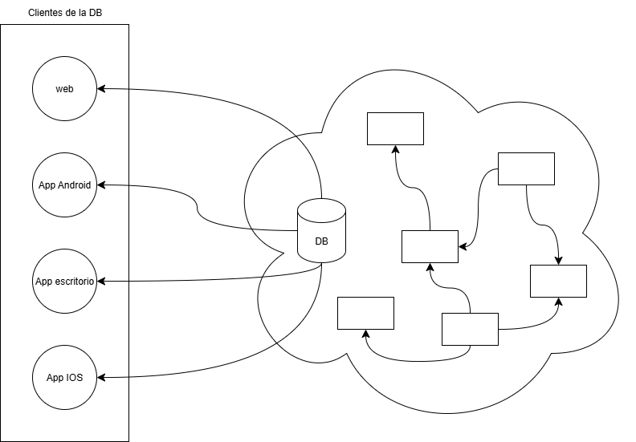
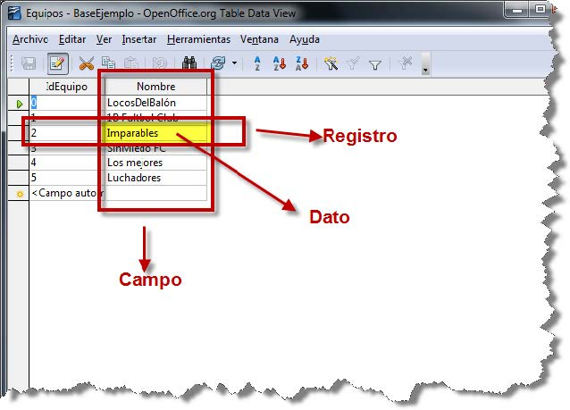
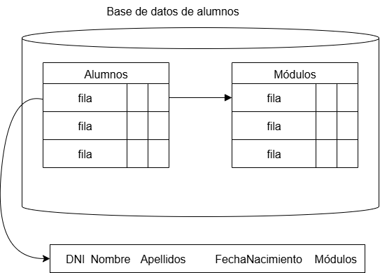
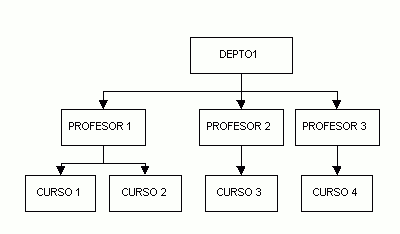
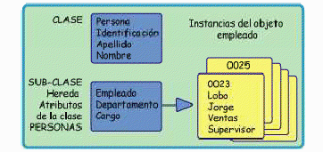
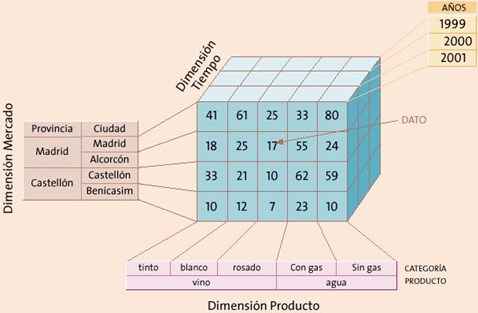
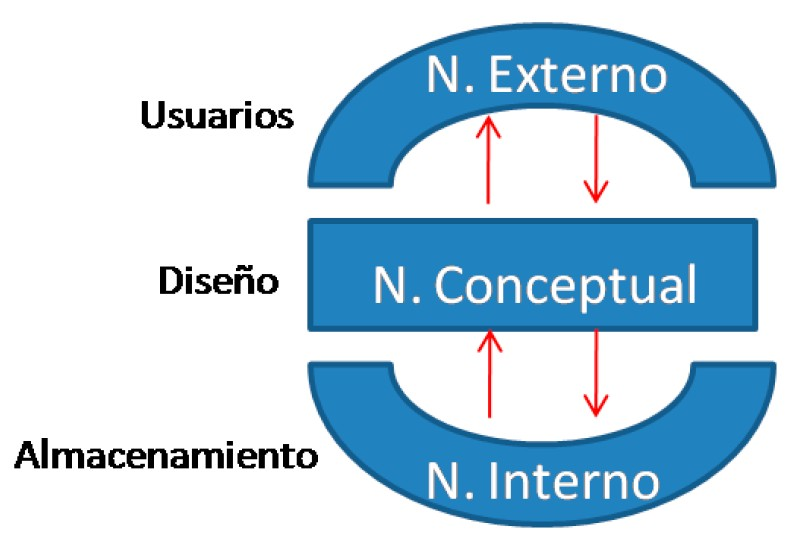
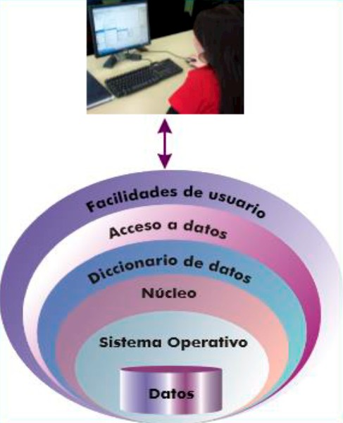
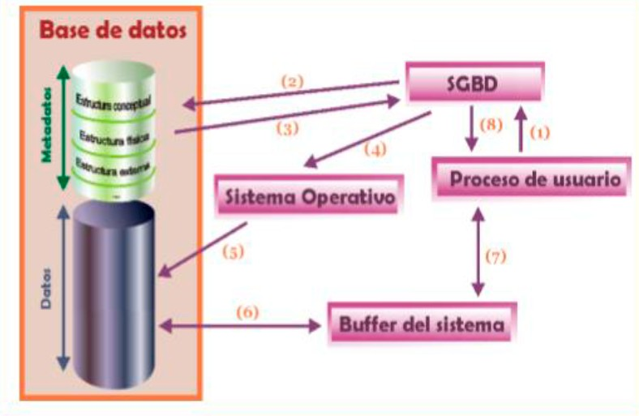
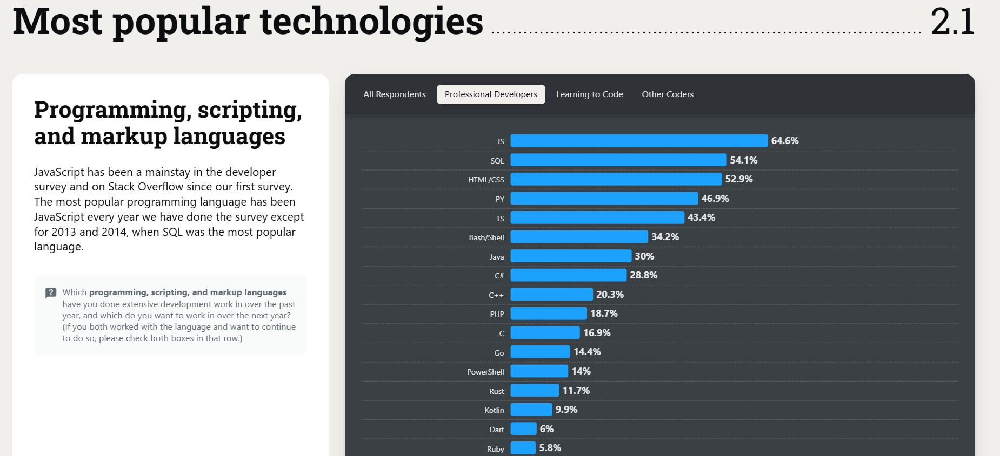

# Unidad 1: Sistemas de Almacenamiento de la Información
Esta unidad tiene como objetivo introducir los conceptos básicos relacionados con los mecanismos de almacenamiento, su clasificación, ventajas e inconvenientes, y sentar las bases para comprender el funcionamiento de los sistemas gestores de bases de datos (SGBD).

- [Unidad 1: Sistemas de Almacenamiento de la Información](#unidad-1-sistemas-de-almacenamiento-de-la-información)
  - [0. Introducción](#0-introducción)
  - [1. Ficheros](#1-ficheros)
    - [1.1 Tipos de ficheros y formatos](#11-tipos-de-ficheros-y-formatos)
    - [1.2 Problemas de los sistemas basados en ficheros](#12-problemas-de-los-sistemas-basados-en-ficheros)
  - [2. Bases de Datos](#2-bases-de-datos)
    - [2.1 Conceptos](#21-conceptos)
    - [2.2 ACID](#22-acid)
    - [2.3 Usos y tipos según el modelo de datos](#23-usos-y-tipos-según-el-modelo-de-datos)
    - [2.4 Ubicación de la información](#24-ubicación-de-la-información)
  - [3. Sistemas Gestores de Bases de Datos (SGBD)](#3-sistemas-gestores-de-bases-de-datos-sgbd)
    - [3.1 Funciones de un SGBD](#31-funciones-de-un-sgbd)
    - [3.2 Componentes de un SGBD](#32-componentes-de-un-sgbd)
    - [3.3 Tipos de SGBD](#33-tipos-de-sgbd)
  - [4. Bases de Datos Centralizadas y Distribuidas](#4-bases-de-datos-centralizadas-y-distribuidas)
    - [4.1 Bases de datos centralizadas](#41-bases-de-datos-centralizadas)
    - [4.2 Bases de datos distribuidas](#42-bases-de-datos-distribuidas)
    - [4.3 Otros modelos de basess de datos](#43-otros-modelos-de-basess-de-datos)
  - [5. Modelo de Capas](#5-modelo-de-capas)
    - [5.1 Arquitectura ANSI-SPARC: los tres niveles](#51-arquitectura-ansi-sparc-los-tres-niveles)
    - [5.2 Modelo funcional de cinco capas](#52-modelo-funcional-de-cinco-capas)
  - [6. Lenguaje SQL](#6-lenguaje-sql)
  - [7. Actividades de aprendizaje](#7-actividades-de-aprendizaje)

## 0. Introducción
En el contexto de los sistemas informáticos, el almacenamiento de la información es un aspecto fundamental que ha evolucionado desde simples estructuras de ficheros hasta complejos sistemas de bases de datos. 

A lo largo de la historia de la informática, el tratamiento de la información ha pasado de ser un proceso centrado en los programas (orientado al proceso) a estar centrado en los datos (orientado a la información). Esta evolución ha permitido mejorar la eficiencia, la seguridad, la integridad y la accesibilidad de los datos, especialmente en entornos multiusuario y distribuidos.


## 1. Ficheros
Los ficheros son estructuras de información que permiten almacenar datos en dispositivos físicos como discos duros, memorias USB, SSD, etc. Son gestionados por el sistema operativo y constituyen la forma más básica de almacenamiento digital. Cada fichero tiene un nombre y una extensión que indica el tipo de contenido que almacena (por ejemplo, .txt, .jpg, .mp3).

### 1.1 Tipos de ficheros y formatos
Los ficheros pueden clasificarse según:

a) Su contenido interno

- **Ficheros de texto**: contienen caracteres codificados en sistemas como ASCII o Unicode. Son legibles por humanos y por editores de texto. Ejemplos:
  - .txt: texto plano.
  - .csv: valores separados por comas.
  - .html: páginas web.
  - .xml: datos estructurados.

- **Ficheros binarios**: contienen datos codificados que no son legibles directamente. Requieren programas específicos para su interpretación. Ejemplos:
    - .exe: ejecutables.
    - .jpg, .png: imágenes.
    - .mp3, .wav: audio.
    - .docx, .xlsx: documentos de ofimática.

> **Ejemplo práctico**: si abrimos un fichero .docx con el bloc de notas, veremos una secuencia de caracteres sin sentido, ya que el editor no interpreta el formato binario. En cambio, un .txt mostrará el contenido directamente.

b) Su organización o forma de acceso
- **Ficheros secuenciales**: los datos se almacenan uno tras otro. Para acceder a un dato específico, es necesario recorrer todos los anteriores. Son eficientes para escritura continua, pero lentos para búsquedas. 

  **Ejemplo**: una lista de clientes en un fichero .txt.

  - En el siguiente ejemplo, para acceder al cliente con DNI 11223344C, hay que recorrer todos los registros anteriores.

| DNI        | Nombre | Apellido | Ciudad   | Teléfono   |
|------------|--------|----------|----------|------------|
| 12345678A  | Juan   | Pérez    | Madrid   | 612345678  |
| 87654321B  | Ana    | Gómez    | Valencia | 698765432  |
| 11223344C  | Luis   | Martín   | Sevilla  | 677889900  |
| 44332211D  | María  | López    | Bilbao   | 699112233  |

- **Ficheros de acceso directo** (organización directa): permiten acceder a un dato concreto sin necesidad de recorrer todo el fichero. Esto se logra mediante posiciones fijas o cálculos de desplazamiento. 

  **Ejemplo**: un fichero donde cada registro ocupa exactamente 100 bytes.

  En este tipo de fichero, cada registro ocupa exactamente **100 bytes**. Esto permite calcular la posición de cualquier registro sin necesidad de recorrer los anteriores.

  Para acceder al **tercer registro** (Luis Martín) dentro de la siguiente tabla de clientes, se multiplica su posición en la tabla (2) por el tamaño del registro:

| Posición | DNI        | Nombre         | Apellido       | Ciudad     | Teléfono   |
|----------|------------|----------------|----------------|------------|------------|
| 0        | 12345678A  | Juan           | Pérez          | Madrid     | 612345678  |
| 100      | 87654321B  | Ana            | Gómez          | Valencia   | 698765432  |
| 200      | 11223344C  | Luis           | Martín         | Sevilla    | 677889900  |
| 300      | 44332211D  | María          | López          | Bilbao     | 699112233  |

- **Ficheros indexados**: utilizan estructuras auxiliares (índices) que permiten localizar rápidamente los datos. El índice actúa como una guía que relaciona claves con posiciones en el fichero. 

  **Ejemplo**: un fichero de libros con un índice por ISBN.

📘 Tabla principal: Libros

| Posición | ISBN         | Título                      | Autor           |
|----------|--------------|-----------------------------|-----------------|
| 0        | 978-84-12345 | Introducción a las BD       | M. Zorrilla     |
| 1        | 978-84-54321 | Fundamentos de SQL          | R. Duque        |
| 2        | 978-84-67890 | Diseño de sistemas          | A. Piattini     |
| 3        | 978-84-98765 | Seguridad en BD             | J. García       |

📗 Índice por ISBN

| ISBN         | Posición en fichero |
|--------------|---------------------|
| 978-84-12345 | 0                   |
| 978-84-54321 | 1                   |
| 978-84-67890 | 2                   |
| 978-84-98765 | 3                   |

Para acceder al libro con ISBN `978-84-67890`, el sistema consulta el índice y localiza que está en la **posición 2** del fichero principal. No es necesario recorrer los registros anteriores.

✅ Ventajas
- Búsqueda rápida por clave.
- Ideal para grandes volúmenes de datos.
- Permite múltiples índices (por autor, título, etc.).

❌ Limitaciones
- Requiere mantener y actualizar los índices.
- Mayor complejidad al introducir datos y borrarlos.

### 1.2 Problemas de los sistemas basados en ficheros
Aunque los ficheros son útiles para almacenar información, presentan varias limitaciones cuando se utilizan como base para sistemas de gestión:
- **Redundancia**: la misma información puede estar duplicada en varios ficheros.
- **Inconsistencia**: si se actualiza un dato en un fichero pero no en otro, se genera incoherencia.
- **Dependencia física**: los programas dependen de la estructura interna del fichero, lo que dificulta su mantenimiento.
- **Falta de seguridad**: no hay control sobre quién accede a qué datos.
- **Acceso limitado**: no se pueden realizar consultas complejas sin desarrollar programas específicos.
- **Dificultad para compartir datos**: cada aplicación puede tener su propio formato, lo que complica la interoperabilidad.

> **Ejemplo**: en una empresa, el departamento de ventas y el de contabilidad pueden tener ficheros distintos con los datos de los clientes. Si un cliente cambia de dirección, ambos ficheros deben actualizarse manualmente. Si se olvida hacerlo en uno de ellos, se genera una inconsistencia.

📁 Departamento de Ventas – Fichero `clientes_ventas.txt`

| DNI        | Nombre | Dirección         | Teléfono   |
|------------|--------|-------------------|------------|
| 12345678A  | Juan   | Calle Mayor, 12   | 612345678  |
| 87654321B  | Ana    | Av. Valencia, 45  | 698765432  |

📁 Departamento de Contabilidad – Fichero `clientes_contabilidad.txt`

| DNI        | Nombre | Dirección         | Teléfono   |
|------------|--------|-------------------|------------|
| 12345678A  | Juan   | Calle Mayor, 12   | 612345678  |
| 87654321B  | Ana    | **Av. Valencia, 47** | 698765432  |

⚠️ Problemas detectados

- **Redundancia**: los datos del cliente `Ana` aparecen en dos ficheros distintos.
- **Inconsistencia**: la dirección de `Ana` es diferente en cada fichero.
- **Dependencia física**: si se cambia el formato de uno de los ficheros, los programas que lo usan pueden dejar de funcionar.
- **Falta de seguridad**: cualquier usuario con acceso al sistema puede modificar los ficheros sin control.
- **Acceso limitado**: no se pueden hacer consultas como “clientes con más de una factura impagada” sin desarrollar un programa específico.
- **Dificultad para compartir datos**: cada departamento usa su propio fichero, lo que complica la integración de la información.

Este ejemplo muestra cómo el uso de ficheros como sistema de almacenamiento puede generar errores, duplicidades y dificultades de gestión. Las bases de datos permiten evitar estos problemas.

## 2. Bases de Datos
Las bases de datos son una evolución natural de los sistemas de almacenamiento de información. Frente a las limitaciones de los ficheros tradicionales, las bases de datos permiten organizar, acceder y gestionar grandes volúmenes de información de forma eficiente, segura y estructurada.

Una base de datos no es solo un conjunto de datos, sino una estructura diseñada para facilitar su uso por múltiples usuarios y aplicaciones, manteniendo la integridad, la coherencia y la disponibilidad de la información.



### 2.1 Conceptos
A continuación se definen los principales elementos que componen una base de datos:
- **Dato**: unidad mínima de información. Es un hecho conocido que puede registrarse y tiene un significado implícito Ejemplo: 2025, Madrid, Juan.
- **Campo**: conjunto de datos del mismo tipo que representan una característica. Ejemplo: Nombre, Fecha de nacimiento.
- **Registro (o tupla)**: cada fila de una tabla, conjunto de campos que describen una entidad. Ejemplo: los datos de un alumno. Ejemplo: los datos de un alumno.
- **Tabla**: colección de registros organizados en filas y columnas. Ejemplo: tabla Alumnos con campos DNI, Nombre, Curso.



- **Tipo de dato**: define la naturaleza del dato. Ejemplos: texto, número entero, fecha, booleano.
  - **Texto**: `VARCHAR`, `TEXT`, `CHAR`
  - **Numéricos**: `INT`, `FLOAT`, `BIGINT`
  - **Fechas**: `DATE`, `DATETIME`, `TIMESTAMP`
  - **Booleanos**: `BOOLEAN`, `TINYINT(1)`
- **Campo clave o clave primaria**: Es un campo especial que identifica de forma única cada registro. Ejemplo: el DNI es clave primaria en una tabla de alumnos y CódigoCliente es clave primaria en una tabla de clientes. 
- **Clave foránea**: campo que hace referencia a la clave primaria de otra tabla, estableciendo una relación entre entidades. Ejemplo: CódigoCliente en la tabla Facturas.
- **Entidad**: todo aquello de lo que interesa guardar datos. Ejemplo: Cliente, Producto, Factura.
- **Relación**: vínculo entre entidades a través de claves foráneas.
  - **Uno a uno (1:1)**: Un alumno tiene una única matrícula.
  - **Uno a muchos (1:N)**: Una empresa tiene muchos empleados.
  - **Muchos a muchos (N:M)**: Un usuario puede conocer varios lenguajes de programación.
  - **Autorreferencia**: Una fila se relaciona consigo misma (ej. jefe de un empleado).


> **Ejemplo**: en una base de datos escolar, podríamos tener una tabla Alumnos con campos como DNI, Nombre, Apellidos, Fecha de nacimiento y módulos, y otra tabla Módulos relacionada con la matrícula de cada alumno.



Otros conceptos: 
- **Metadatos**: datos sobre los datos. Incluyen el tipo, nombre, longitud, restricciones, etc.
- **Consulta**: instrucción que permite recuperar información de la base de datos según ciertos criterios.
- **Índice**: estructura que acelera la búsqueda de registros en una tabla.
- **Vista**: tabla virtual generada a partir de una o varias tablas, útil para mostrar solo ciertos datos.
- **Informe**: presentación estructurada de los datos, normalmente como salida de una consulta.
- **Scripts o guiones**: conjunto de instrucciones que automatizan tareas sobre la base de datos.
- **Procedimientos**: son un tipo especial de script que se encuentra almacenado en la base de datos.

> Actividad 1: Conceptos de bases de datos

### 2.2 ACID
En el contexto de las bases de datos, ACID es un acrónimo que representa cuatro propiedades (Atomicidad, Consistencia, Aislamiento y Durabilidad) que aseguran la fiabilidad e integridad de las transacciones de la base de datos. Estas propiedades garantizan que un conjunto de operaciones se ejecute de manera segura y que los datos se mantengan en un estado válido, incluso frente a errores o fallas del sistema. 

Las cuatro propiedades ACID:
1. **Atomicidad** (Atomicity):
Se refiere al principio de "todo o nada". Si una transacción tiene múltiples pasos, o todos se completan con éxito, o ninguno de ellos se realiza, revirtiendo cualquier cambio. 
2. **Consistencia** (Consistency):
Asegura que cualquier transacción lleva la base de datos de un estado válido a otro estado válido. Esto significa que la integridad de los datos se mantiene, y las reglas y restricciones definidas por la base de datos se cumplen. 
3. **Aislamiento** (Isolation):
Garantiza que, cuando múltiples transacciones se ejecutan simultáneamente, cada una opera de manera independiente y no interfiere con las otras. El estado intermedio de una transacción no es visible para otras. 
4. **Durabilidad** (Durability):
Una vez que una transacción se confirma (commits), sus cambios son permanentes y se mantienen incluso si hay una falla de alimentación, un error o una caída del sistema. 

Importancia de ACID:
- **Integridad de los datos**: Las propiedades ACID son fundamentales para mantener la exactitud y validez de la información en la base de datos. 
- **Fiabilidad**: Son cruciales para aplicaciones donde la precisión de los datos es crítica, como en sistemas bancarios o de reservas. 
- **Gestión de transacciones**: Permiten a las bases de datos gestionar operaciones complejas de forma segura, asegurando la continuidad del negocio. 

Ejemplos de su aplicación: 
- Sistemas bancarios: Aseguran que las transferencias de dinero sean completas, correctas y permanentes. 
- Sistemas de reservas: Garantizan que un asiento reservado no pueda ser reservado por dos usuarios simultáneamente. 

### 2.3 Usos y tipos según el modelo de datos

Las bases de datos se utilizan en prácticamente todos los ámbitos de la sociedad:
- **Administración**: gestión de clientes, facturas, productos, empleados.
- **Educación**: control de alumnos, profesores, asignaturas, evaluaciones.
- **Ciencia**: almacenamiento de datos experimentales, simulaciones, estadísticas.
- **Salud**: historiales médicos, citas, tratamientos.
- **Comercio electrónico**: catálogos de productos, pedidos, usuarios.
- **Motores de búsqueda**: como Google, que utilizan bases de datos distribuidas de gran tamaño.

Tipos de bases de datos según el modelo de datos:
- **Jerárquicas**: organizan los datos en forma de árbol. *Obsoletas*.



- **En red**: permiten relaciones más complejas entre registros. *También en desuso*.
- **Relacionales**: organizan los datos en tablas relacionadas. Son las más utilizadas. Ejemplo: MySQL, PostgreSQL.


- **No relacionales** o **NoSQL**, son sistemas de almacenamiento de datos que no utilizan el modelo tabular de filas y columnas de las bases de datos relacionales. Se caracterizan por sus **estructuras flexibles** y esquemas dinámicos, adaptándose mejor a grandes volúmenes de datos no estructurados o semiestructurados. Ofrecen alta escalabilidad y rendimiento, lo que las hace ideales para aplicaciones web modernas, redes sociales y Big Data, aunque suelen sacrificar la consistencia ACID por la velocidad y escalabilidad horizontal. Dentro de las bases de datos no relacionales encontramos las siguientes:
  - **Documentales**: almacenan datos semiestructurados como JSON o XML. Ejemplo: MongoDB.
  - Clave-valor: como Redis, DynamoDB.
  - Columnar: como Cassandra, HBase.
  - Grafos: como Neo4j, OrientDB.

  

- **Orientadas a objetos**: permiten almacenar objetos completos con sus atributos y métodos.



- **Objeto-relacionales**: combinan características de las relacionales y orientadas a objetos.

- **Multidimensionales**: usadas en inteligencia de negocio (OLAP).



### 2.4 Ubicación de la información
La ubicación física de una base de datos influye en su accesibilidad, rendimiento y seguridad. Existen varios modelos:
- **Local**: la base de datos se encuentra en el mismo equipo que la aplicación. Ejemplo: una base de datos en Access.
- **En servidor**: la base de datos reside en un servidor y se accede desde otros equipos a través de una red local o Internet.
- **Distribuida**: los datos se reparten entre varios servidores geográficamente separados. Ejemplo: bases de datos de grandes empresas con sedes en distintas ciudades.
- **Reflejada**: se mantiene una copia exacta de la base de datos en varios servidores para garantizar disponibilidad y seguridad.

> Ejemplo práctico: una empresa con oficinas en Madrid, Barcelona y Valencia puede tener una base de datos distribuida, donde cada sede gestiona sus propios datos, pero todos están sincronizados.


## 3. Sistemas Gestores de Bases de Datos (SGBD)
Un **Sistema Gestor de Bases de Datos (SGBD)** es un conjunto de programas que permite crear, administrar y utilizar bases de datos de forma eficiente. Su aparición supuso una mejora significativa respecto al uso de ficheros, al ofrecer mecanismos para garantizar la integridad, seguridad y accesibilidad de los datos, incluso en entornos multiusuario y distribuidos.

### 3.1 Funciones de un SGBD
Las funciones de un SGBD pueden variar según el tipo y el fabricante, pero en general incluyen:

- **Almacenamiento, acceso y actualización de datos**: permite a los usuarios realizar operaciones como insertar, modificar, eliminar y consultar datos.
- Garantía de **integridad**: asegura que los datos cumplen ciertas reglas (por ejemplo, que una fecha no sea anterior a hoy).
- **Seguridad**: controla qué usuarios pueden acceder a qué datos y qué operaciones pueden realizar.
- **Concurrencia**: permite que varios usuarios accedan simultáneamente a la base de datos sin interferencias.
- **Gestión de transacciones**: agrupa operaciones en bloques que se ejecutan como una unidad (con propiedades ACID: atomicidad, consistencia, aislamiento, durabilidad).
- **Independencia de los datos**: los datos están separados de las aplicaciones que los usan, lo que facilita su mantenimiento.
- **Recuperación** ante fallos: incluye mecanismos para restaurar la base de datos en caso de errores o caídas del sistema.
- **Diccionario de datos**: almacena metadatos sobre la estructura de la base de datos.
- **Estadísticas y auditoría**: registra operaciones realizadas, errores, accesos, etc.

> **Ejemplo**: en una base de datos de una tienda online, el SGBD garantiza que dos usuarios no puedan comprar el mismo producto si solo queda una unidad disponible, gracias a la gestión de concurrencia y transacciones (vemos el concepto a continuación).

### 3.2 Componentes de un SGBD
Un SGBD está formado por varios componentes que trabajan conjuntamente:
- **Procesador de consultas**: interpreta las instrucciones SQL y genera un plan de ejecución.
- **Motor de ejecución**: realiza las operaciones solicitadas sobre los datos.
- **Gestor de transacciones**: asegura que las operaciones agrupadas se ejecuten correctamente.
- **Gestor de concurrencia**: controla el acceso simultáneo a los datos.
- **Gestor de recuperación**: permite restaurar la base de datos tras un fallo.
- **Gestor de almacenamiento**: organiza los datos en disco y gestiona el espacio.
- **Gestor de archivos**: interactúa con el sistema operativo para acceder a los ficheros físicos.
- **Memoria intermedia** (buffer): almacena temporalmente los datos más usados para mejorar el rendimiento.
- **Diccionario de datos**: contiene información sobre la estructura de la base de datos (tablas, campos, relaciones, restricciones).

> **Ejemplo**: el _procesador de consultas_ traduce una instrucción SELECT en una serie de pasos que el _motor_ ejecuta, accediendo a los datos a través del _gestor de almacenamiento_ y utilizando el _buffer_ para acelerar el proceso. Conoceremos en detalle la función SELECT en próximas unidades.

### 3.3 Tipos de SGBD
Los SGBD se pueden clasificar según distintos criterios:

a) Por modelo de datos
- **Relacionales**: basados en tablas y relaciones. Ejemplo: MySQL, PostgreSQL, Oracle.
- **Objeto-relacionales**: combinan tablas con estructuras orientadas a objetos. Ejemplo: Oracle, SQL Server.
- **Orientados a objetos**: almacenan objetos completos. Ejemplo: db4o, ObjectDB.
- **NoSQL**: diseñados para datos no estructurados o semiestructurados. Ejemplo: MongoDB, Cassandra.

b) Por uso
- **Ofimáticos**: pensados para uso personal o en pequeñas organizaciones. Ejemplo: Microsoft Access, LibreOffice Base.
- **Corporativos**: diseñados para entornos empresariales con grandes volúmenes de datos y múltiples usuarios. Ejemplo: Oracle, IBM DB2, SAP Sybase.

c) Por arquitectura
- **Centralizados**: toda la base de datos reside en un único servidor.
- **Distribuidos**: los datos se reparten entre varios servidores.
- **En la nube**: servicios gestionados por terceros, accesibles desde cualquier lugar. Ejemplo: Amazon RDS, Google Cloud SQL.

> Investiga qué tipo de SGBD utilizan varias aplicaciones que conozcas (por ejemplo, Moodle, WordPress, una app móvil) y clasifícalo según su modelo y arquitectura.

> Actividad: Instalación y uso de un SGBD

## 4. Bases de Datos Centralizadas y Distribuidas
La forma en que se almacena y se accede a la información en una base de datos puede variar según la arquitectura del sistema. Esta arquitectura influye directamente en aspectos como el rendimiento, la escalabilidad, la seguridad y la disponibilidad de los datos.

### 4.1 Bases de datos centralizadas
Una base de datos centralizada es aquella en la que toda la información se almacena en un único servidor. Este servidor actúa como punto de acceso para todos los usuarios y aplicaciones que necesitan consultar o modificar los datos.

✅ Ventajas:
- Administración más sencilla.
- Mayor control sobre la seguridad y el acceso.
- Menor complejidad técnica.

❌ Inconvenientes:
- Punto único de fallo: si el servidor se cae, toda la base de datos queda inaccesible.
- Problemas de rendimiento si hay muchos usuarios concurrentes.
- Dificultades para escalar en entornos distribuidos o geográficamente dispersos.

> **Ejemplo**: la base de datos de una biblioteca escolar que se gestiona desde un único ordenador en la sala de profesores.

### 4.2 Bases de datos distribuidas
Una base de datos distribuida es aquella en la que los datos se almacenan en **varios servidores conectados entre sí** mediante una red. Cada servidor puede contener una parte de la base de datos o una copia completa, dependiendo del modelo de distribución.

✅ Ventajas:
- Mayor disponibilidad: si un nodo falla, otros pueden seguir funcionando.
- Mejor rendimiento en entornos con muchos usuarios o ubicaciones geográficas distintas.
- Escalabilidad: se pueden añadir nuevos nodos fácilmente.

❌ Inconvenientes:
- Mayor complejidad en la administración.
- Necesidad de sincronización entre nodos.
- Riesgo de inconsistencias si no se gestiona correctamente la concurrencia.

> **Ejemplo**: una empresa con sedes en distintas ciudades que almacena los datos de cada oficina en servidores locales, pero sincronizados entre sí para mantener una visión global.

### 4.3 Otros modelos de basess de datos
Además de las bases de datos centralizadas y distribuidas, existen otros modelos que complementan esta clasificación:
- **Bases de datos reflejadas**: se mantiene una copia exacta de la base de datos en varios servidores, lo que mejora la disponibilidad y la seguridad ante fallos.
- **Bases de datos locales**: el acceso se realiza desde el mismo equipo que almacena la base de datos, sin necesidad de red.

> Razona si una base de datos reflejada y una local son bases de datos centralizadas o distribuídas.

## 5. Modelo de Capas
El modelo de capas en los sistemas gestores de bases de datos (SGBD) describe cómo se organiza y accede a la información desde distintos niveles de abstracción. Este modelo permite separar la forma en que los datos se almacenan físicamente de cómo se ven y utilizan por parte de los usuarios y aplicaciones.

### 5.1 Arquitectura ANSI-SPARC: los tres niveles
La [arquitectura propuesta por ANSI-SPARC](https://es.wikipedia.org/wiki/Arquitectura_ANSI-SPARC) en 1975 define tres niveles de visión de una base de datos:



- **Nivel externo** (de vistas)
  - Define cómo los usuarios o aplicaciones ven los datos.
  - Cada vista puede mostrar solo una parte de la base de datos, ocultando información sensible o irrelevante.
  - Permite personalizar el acceso según el perfil del usuario.
- **Nivel conceptual** (lógico)
  - Representa la estructura lógica de la base de datos: entidades, atributos, relaciones y restricciones.
  - Es independiente de cómo se almacenan físicamente los datos.
  - Es el esquema general que define toda la base de datos.
- **Nivel interno** (físico)
  - Describe cómo se almacenan los datos en el sistema de almacenamiento (disco, SSD, etc.).
  - Incluye estructuras como árboles B+, índices, montones, particiones, etc.
  - Cada SGBD implementa este nivel de forma propia y no estandarizada.

> **Ejemplo**: un profesor puede ver los datos de sus alumnos (vista externa), mientras que el administrador del sistema tiene acceso completo al esquema lógico (nivel conceptual), y el sistema operativo gestiona cómo se almacenan los datos en disco (nivel interno).

Gracias a esta arquitectura, se consigue la **independencia de los datos**, lo que conlleva:
- Independencia lógica: se pueden modificar el esquema conceptual (añadir atributos, relaciones, restricciones) sin afectar las vistas ni los programas de aplicación.
- Independencia física: se pueden cambiar las estructuras de almacenamiento (índices, particiones, ubicación en disco) sin afectar el esquema lógico ni las vistas.

```
“La independencia de los datos es la inmunidad de las aplicaciones ante cambios en la estructura del almacenamiento y en los métodos de acceso.”
                          Definición de C.J. Date (1981)
```
### 5.2 Modelo funcional de cinco capas
Además de los tres niveles de abstracción, los SGBD modernos operan siguiendo un modelo funcional de cinco capas que describe el flujo de una consulta desde el usuario hasta el sistema operativo. Este modelo tiene las siguientes caracterísitcas:
- Facilidades para el usuario: interfaces gráficas, formularios, asistentes, etc.
- Capa de acceso a datos: traduce las peticiones del usuario a instrucciones comprensibles por el sistema.
- Diccionario de datos: interpreta las solicitudes en función del esquema interno.
- Núcleo del SGBD: traduce las instrucciones para que el sistema operativo pueda ejecutarlas.
- Sistema operativo: accede físicamente a los datos en el dispositivo de almacenamiento.

En base a esos tres niveles de visión de las bases de datos, los SGBD realizan todos los procesos operando conforme a un modelo de cinco capas:


De este modo, el esquema de procesamiento en una petición de usuario al SGBD
según el modelo de capas es el siguiente:



## 6. Lenguaje SQL
El lenguaje [SQL](https://es.wikipedia.org/wiki/SQL) (Structured Query Language traducido como lenguaje de consulta estructurada) es el estándar para interactuar con bases de datos relacionales. Es uno de los lenguajes más usados en el entorno profesional y de los más estudiados (consultar [survey.stackoverflow.co](https://survey.stackoverflow.co/2024/technology#most-popular-technologies-language-prof)). Es importante saber que no se trata de un lenguaje de programación sinó de programación sinó de un **lenguaje de consulta**. 



SQL permite:
- Definir estructuras (tablas, relaciones, tipos de datos).
- Manipular datos (consultas, inserciones, modificaciones, borrados).
- Controlar accesos (usuarios, privilegios).
- Gestionar transacciones (confirmar o deshacer operaciones).

SQL está estandarizado por la ISO y se divide en varios sublenguajes, cada uno con una función específica:

- **Lenguaje DDL** (Data Definition Language): Permite definir la estructura física de la base de datos (tablas, relaciones entre tablas, tipos de datos de las tablas, etc.). DDL (Data Definition Language): Definición de estructuras.
  - CREATE: Crear tablas, índices, vistas, etc.
  - ALTER: Modificar estructuras existentes.
  - DROP: Eliminar objetos de la base de datos.

- **Lenguaje DML** (Data Manipulation Language): Permite consultar y modificar los datos. Se utiliza para realizar consultas, inserciones, borrados y modificaciones de los datos. Las principales instrucciones son: 
  - SELECT: Consulta de datos.
  - INSERT: Inserción de registros.
  - UPDATE: Modificación de registros.
  - DELETE: Eliminación de registros.

- **Lenguaje DCL** (Data Control Language): Se usa para controlar la seguridad, integridad y privacidad de las bases de datos (crear usuarios, definir privilegios de usuario, dar permisos sobre tablas, establecer mecanismos de recuperación de la información, etc.). 
  - GRANT: Conceder permisos.
  - REVOKE: Revocar permisos.

- Lenguaje TCL (Transaction Control Language): Se utiliza para el control de transacciones.
  
  Una transacción es un conjunto de operaciones que deben ejecutarse como una unidad. Las propiedades ACID garantizan su fiabilidad: Atomicidad (todo o nada), Consistencia (coherencia), Aislamiento (independencia), Durabilidad (persistencia).

  Las principales instrucciones son:
  - COMMIT: Confirmar cambios.
  - ROLLBACK: Deshacer cambios.

Como referencias para aprender SQL nos basaremos en la guía de [w3schools.com](https://www.w3schools.com/sql/)

## 7. Actividades de aprendizaje
Se recomienda realizar prácticas con Access o LibreOffice Base: crear tablas, establecer relaciones, diseñar formularios, generar informes, ejecutar consultas.

**Actividad:** Realiza una práctica guiada con Access que incluya creación de tablas, relaciones y consultas.
