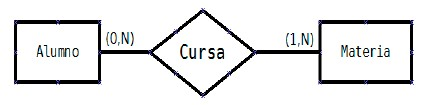
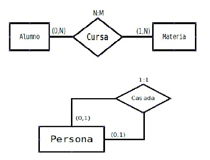

# Unidad 2: Diseño lógico de bases de datos

- [Unidad 2: Diseño lógico de bases de datos](#unidad-2-diseño-lógico-de-bases-de-datos)
- [1. Introducción al diseño lógico](#1-introducción-al-diseño-lógico)
  - [1.1. ¿Qué es el diseño lógico?](#11-qué-es-el-diseño-lógico)
  - [1.2. Fases del diseño de bases de datos](#12-fases-del-diseño-de-bases-de-datos)
  - [1.3. Modelos de datos: conceptual, lógico y físico](#13-modelos-de-datos-conceptual-lógico-y-físico)
- [2. Modelización conceptual del software](#2-modelización-conceptual-del-software)
  - [2.1. Modelización de datos](#21-modelización-de-datos)
  - [2.2. Diccionario de datos](#22-diccionario-de-datos)
  - [2.3. Modelo Conceptual de Datos (MCD)](#23-modelo-conceptual-de-datos-mcd)
- [3. Diagrama Entidad/Relación (DER)](#3-diagrama-entidadrelación-der)
  - [3.1. Entidad](#31-entidad)
  - [3.2. Clave primaria y claves candidatas](#32-clave-primaria-y-claves-candidatas)
  - [3.3. Atributos](#33-atributos)
  - [3.4. Relación](#34-relación)
  - [3.5. Cardinalidad y modalidad](#35-cardinalidad-y-modalidad)
  - [3.6 Construir un diagrama E/R](#36-construir-un-diagrama-er)
  - [3.7 Debilidad](#37-debilidad)
  - [3.8 Ejemplo completo de E/R](#38-ejemplo-completo-de-er)
- [4. Diagrama Entidad/Relación Extendido (DER-E)](#4-diagrama-entidadrelación-extendido-der-e)
  - [4.1. Atributos compuestos, multivaluados y derivados](#41-atributos-compuestos-multivaluados-y-derivados)
  - [4.2. Generalización/especialización](#42-generalizaciónespecialización)
  - [4.3. Agregación](#43-agregación)
- [5. Reglas de integridad](#5-reglas-de-integridad)
  - [5.1. Integridad de entidad](#51-integridad-de-entidad)
  - [5.2. Integridad referencial](#52-integridad-referencial)
  - [5.3. Integridad de dominio](#53-integridad-de-dominio)
- [6. Normalización](#6-normalización)
  - [6.1. Concepto y objetivos](#61-concepto-y-objetivos)
  - [6.2. Primera Forma Normal (1FN)](#62-primera-forma-normal-1fn)
- [7. Restricciones no representables en el modelo lógico](#7-restricciones-no-representables-en-el-modelo-lógico)

# 1. Introducción al diseño lógico

## 1.1. ¿Qué es el diseño lógico?
El diseño lógico de bases de datos es la fase intermedia entre el análisis del problema y la implementación física de la base de datos Consiste en **representar la información relevante** de un dominio del mundo real mediante un modelo que pueda ser interpretado por un sistema gestor de bases de datos (SGBD).

El diseño lógico:
- **No depende del SGBD** que se vaya a utilizar.
- Representa los datos mediante estructuras como tablas, atributos, claves y relaciones.
- Se basa en el modelo conceptual, normalmente representado mediante diagramas entidad/relación (E/R), que veremos en esta unidad.

> Ejemplo: En una empresa que gestiona pedidos, el diseño lógico incluiría tablas como Clientes, Pedidos, Productos, con sus respectivos campos y relaciones entre ellas.

## 1.2. Fases del diseño de bases de datos
El proceso completo de diseño de una base de datos se divide en tres fases:
- **Diseño conceptual**
  - Representa el problema desde el punto de vista del usuario.
  - Utiliza diagramas E/R para modelar entidades, relaciones, atributos, cardinalidades, etc.
- **Diseño lógico**
  - Traduce el modelo conceptual a un modelo relacional.
  - Define tablas, claves primarias y foráneas, restricciones de integridad, etc.
- **Diseño físico**
  - Implementa el modelo lógico en un SGBD concreto.
  - Incluye aspectos como tipos de datos, índices, rendimiento, almacenamiento.

Saltarse el diseño conceptual puede ahorrar tiempo en problemas simples, pero en sistemas complejos puede generar incoherencias y pérdida de calidad.

## 1.3. Modelos de datos: conceptual, lógico y físico

| Modelo       | Descripción | Herramientas |
|--------------|--------------|--------------|
| Conceptual   | Representa el problema desde el punto de vista del usuario.     | Diagramas E/R     |
| Lógico       | Traduce el modelo conceptual a estructuras que entiende el SGBD.   | Modelo relacional    |
| Físico       | Implementa el modelo lógico en un SGBD concreto.   | SQL (DDL), índices, tipos de datos     |

> Ejemplo:
>  - Conceptual: Entidades Empleado, Departamento, relación Trabaja_en.
>  - Lógico: Tablas Empleados, Departamentos, con claves primarias y foráneas.
>  - Físico: Script SQL que crea las tablas en MySQL.

# 2. Modelización conceptual del software

## 2.1. Modelización de datos

La modelización de datos es el proceso mediante el cual se representa la información relevante de un sistema mediante estructuras que permiten su análisis, diseño y posterior implementación en una base de datos.

> Ejemplo: En una clínica veterinaria, el diseño conceptual incluiría entidades como Mascota, Dueño, Tratamiento. El diseño lógico definiría tablas con claves primarias y foráneas. El diseño físico implementaría esas tablas en MySQL con tipos de datos concretos.

Interacción entre modelos:
- El modelo conceptual se negocia con el usuario.
- l modelo lógico se adapta al SGBD.
- El modelo físico se implementa en SQL.
## 2.2. Diccionario de datos
El diccionario de datos (o metabase) es una herramienta que almacena metadatos, es decir, datos sobre los datos. Incluye:
- Nombre de las tablas
- Campos (atributos)
- Tipos de datos
- Claves primarias y foráneas
- Restricciones (NOT NULL, UNIQUE, CHECK)
- Índices

> Ejemplo:
> - Tabla: TPaciente
> - Campos: dni, nombre, fecha_nacimiento, telefono
> - Clave primaria: dni
> - Clave ajena: dni → TConsulta.dni_paciente
> - Índices: iPaciente_nombre (nombre ASC)

Este diccionario permite a los desarrolladores consultar la estructura lógica de la base de datos y facilita su mantenimiento.

## 2.3. Modelo Conceptual de Datos (MCD)
El MCD representa la visión estática del dominio del problema. Permite identificar:
- Entidades
- Atributos
- Relaciones
- Cardinalidades
- Modalidades

Características del MCD:
- Representa el universo del discurso (todo lo que debe manejar el sistema).
- Refleja el estado final de los datos.
- Debe actualizarse si cambian los requisitos del sistema.

Herramienta principal: **Diagrama Entidad/Relación (DER)**
Propuesto por Peter Chen (1976), es una técnica estandarizada para representar datos de forma gráfica e independiente del SGBD.

> Ejemplo:
> En una tienda de bicicletas:
> - Entidades: Bicicleta, Cliente, Venta
> - Atributos: marca, modelo, precio, fecha_venta
> - Relaciones: compra (entre Cliente y Bicicleta)
> - Cardinalidad: Un cliente puede comprar varias bicicletas, pero cada bicicleta solo puede ser comprada por un cliente → 1:N

# 3. Diagrama Entidad/Relación (DER)

A lo largo de los años se han desarrollado varios modelos E/R y diagramas de representación para el modelo. En este curso vamos a usar el **modelo de Chen**. Este es un ejemplo de diagrama E/R que usa las normas de representación de Chen.

## 3.1. Entidad

Una entidad es un objeto, sujeto o concepto sobre el que se recoge información básica en el sistema para poder realizar los procesos que se requieran.

Ejemplos de entidades en un sistema de gestión de un centro de estudios:
- ALUMNO
- PROFESOR
- ASIGNATURA
- CURSO

Las entidades se representan en los diagramas E/R mediante rectángulos.

## 3.2. Clave primaria y claves candidatas
Una clave identifica de forma única a cada elemento de una entidad.
- Clave primaria o principal: la más adecuada según criterios de simplicidad, longitud, representatividad y estabilidad.
- Claves secundarias o alternativas: Puede haber varias en una entidad pero no se debe abusar de estas claves. Serán todas aquellas que decidamos, aparte de la primaria

## 3.3. Atributos
Los atributos pueden pertenecer tanto a entidades como a relaciones. Se representan mediante círculos conectados a la entidad o relación correspondiente.

Ejemplo de representación de los atributos de la entidad Alumno:

**Dominio de los atributos**: El dominio de un atributo es todo el conjunto de valores que se pueden asignar a ese atributo. Por ejemplo, el atributo DNI de la entidad Alumno tiene como dominio una *cadena de caracteres de longitud 9*.

> Ejercicio1 : Indica cual sería el dominio de cada uno de los siguientes atributos de la entidad PERSONA:
> - Fecha de nacimiento
> - Localidad de nacimiento
> - Edad
> - EsMayorDeEdad
> - DNI
> - Teléfonos
> - Nombre
> - Apellidos

**Tipos de atributos**:
- Simples / Compuestos: Ej. FECHA puede dividirse en DÍA, MES, AÑO.

- Monovaluados / Multivaluados: Ej. TELÉFONO puede tener varios valores.

- Obligatorios / Opcionales: Ej. AFICIONES puede ser opcional.

- Derivados / No derivados: Un atributo es derivado si se puede obtener a partir de los datos contenidos en otros atributos y es no derivado si su valor no depende de ningún otro atributo. **No es recomendable el uso de atributos derivados**. Ej. IMPORTE_VENTA derivado de UNIDADES y PRECIO.

**Represenración de los atributos**:

> Ejercicio 2: Justifica si los siguientes atributos serían obligatorio-opcional, compuesto-simple, derivado-no derivado, monovaluado-multivaluado.
> - Fecha de nacimiento
>- Localidad de nacimiento
> - Edad
> - EsMayorDeEdad
> - DNI
> - Teléfonos
> - Nombre
> - Apellidos

## 3.4. Relación
Una relación es una asociación entre varias entidades a través de una acción realizable entre ellas.

Ejemplos:
- COMPRAR (entre CLIENTE y PRODUCTO)
- CURSAR (entre ALUMNO y MÓDULO)
- SER_HIJO (entre ALUMNO y PADRE)
- SER_JEFE (entre elementos de la entidad EMPLEADO)

Tipos de relaciones:
- Binaria (grado 2): entre dos entidades.

- Unaria o reflexiva (grado 1): entre elementos de la misma entidad.

- Ternaria (grado 3): entre tres entidades.

Las relaciones también pueden tener atributos (se explican más adelante).

## 3.5. Cardinalidad y modalidad
La cardinalidad indica el número mínimo y máximo de ocurrencias de una entidad que pueden estar relacionadas con una ocurrencia de otra entidad.

Se representa como un par de números entre paréntesis:
- (0,1) → mínimo cero, máximo uno
- (1,1) → mínimo uno, máximo uno
- (0,N) → mínimo cero, máximo muchos
- (1,N) → mínimo uno, máximo muchos

Tipos de correspondencia:
- 1:1 (uno a uno): Ej. CASADO entre PERSONA y PERSONA
- 1:N (uno a muchos): Ej. PERTENECE entre MUNICIPIO y PROVINCIA
- N:M (muchos a muchos): Ej. COMPRA entre PRODUCTO y CLIENTE

> ejercicios diapositivas

## 3.6 Construir un diagrama E/R
Para construir un diagrama E/R completo se recomienda seguir estos pasos metodológicos:
- Leer y comprender el problema.
- Identificar entidades, relaciones y atributos.
- Proponer claves primarias y establecer tipos de atributos y dominios.
- Identificar generalizaciones/especializaciones y relaciones de debilidad.
- Determinar cardinalidades y tipos de correspondencia.
- Representar gráficamente el esquema.
- Revisar y refinar el diagrama.

## 3.7 Debilidad
Una entidad es débil frente a otra que es fuerte cuando para existir un elemento de la débil es necesario que exista un elemento de la fuerte.

Por ejemplo, en la gestión de pedidos y ventas de un comercio, un pedido consta de varias líneas de pedido (una por cada producto). Si PEDIDO es una entidad y LINEA_PEDIDO es otra entidad, PEDIDO sería entidad fuerte y LINEA_PEDIDO una entidad débil respecto de la anterior.

Las entidades débiles se representan en los diagramas E/R rodeadas por una
línea doble:

También podemos encontrar representada la relación entre una entidad fuerte y una débil con una **relación débil**. Esto se representa mediente un doble rombo. 

- Dependencia en existencia: Las ocurrencias de una entidad débil no tienen ningún sentido en la base de datos sin una ocurrencia de la entidad fuerte con la que están relacionadas.

- Dependencia en identificación: Además de la dependencia en existencia, la entidad débil necesita a la fuerte para poder crear una clave a partir de la clave que tiene la entidad fuerte. Es decir, en el ejemplo, cada línea de pedido se identificaría con
numPed y numLinea.

## 3.8 Ejemplo completo de E/R

> Actividad 2.1

# 4. Diagrama Entidad/Relación Extendido (DER-E)

## 4.1. Atributos compuestos, multivaluados y derivados
## 4.2. Generalización/especialización
## 4.3. Agregación

# 5. Reglas de integridad

## 5.1. Integridad de entidad
## 5.2. Integridad referencial
## 5.3. Integridad de dominio

# 6. Normalización

## 6.1. Concepto y objetivos
## 6.2. Primera Forma Normal (1FN)
6.3. Segunda Forma Normal (2FN)
6.4. Tercera Forma Normal (3FN)
6.5. Ejemplo completo de normalización

# 7. Restricciones no representables en el modelo lógico

7.1. Reglas de negocio complejas
7.2. Validaciones condicionales
7.3. Restricciones temporales o contextuales

